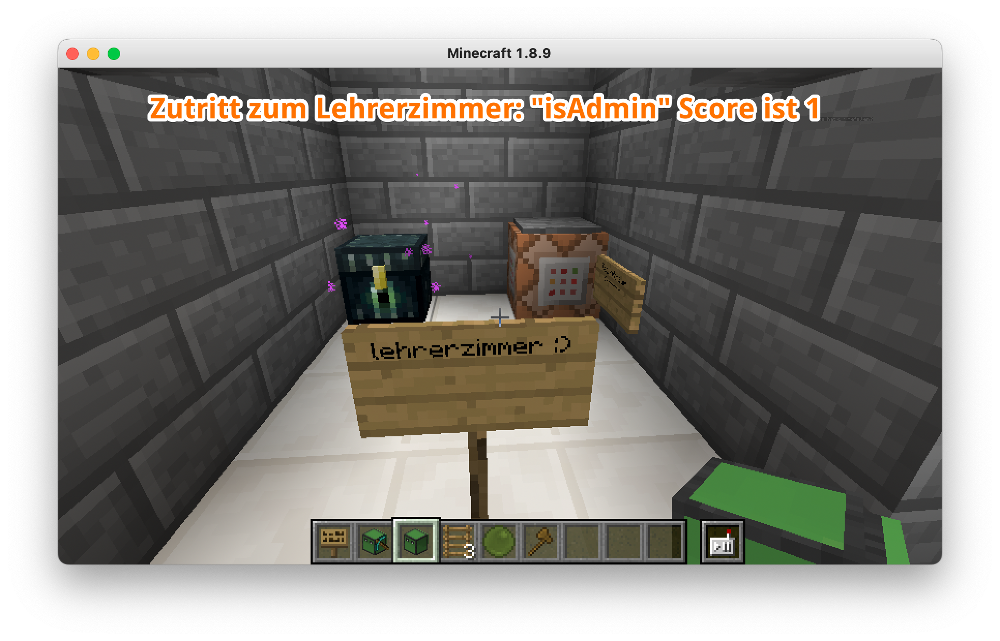
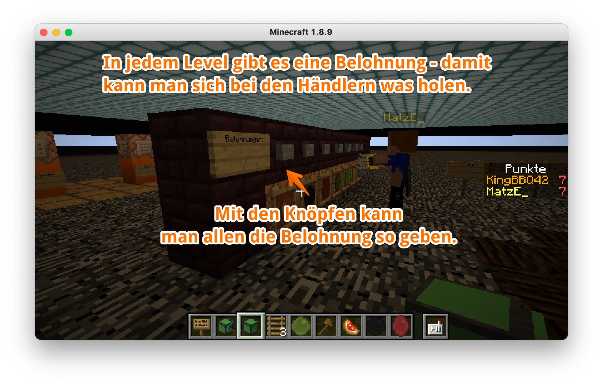
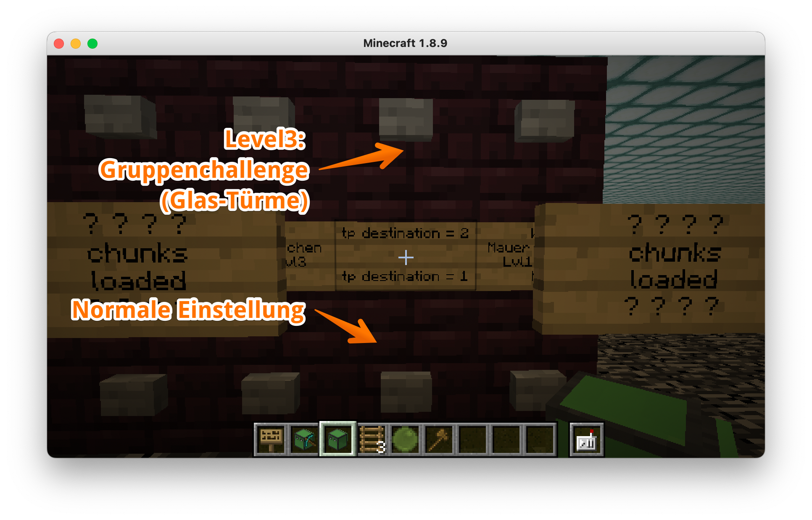
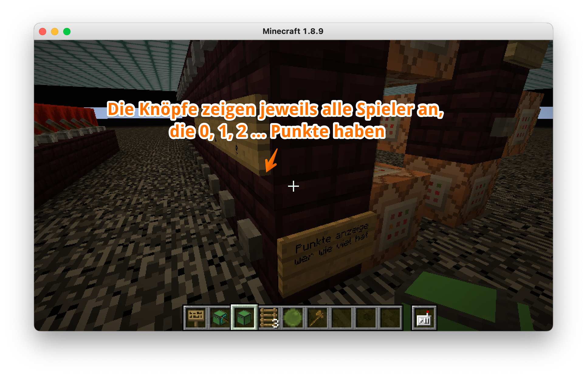
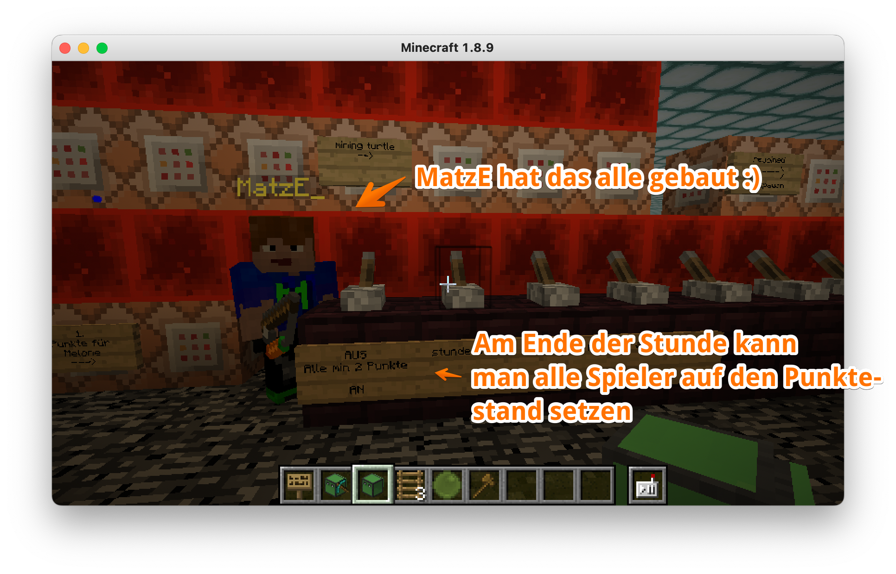
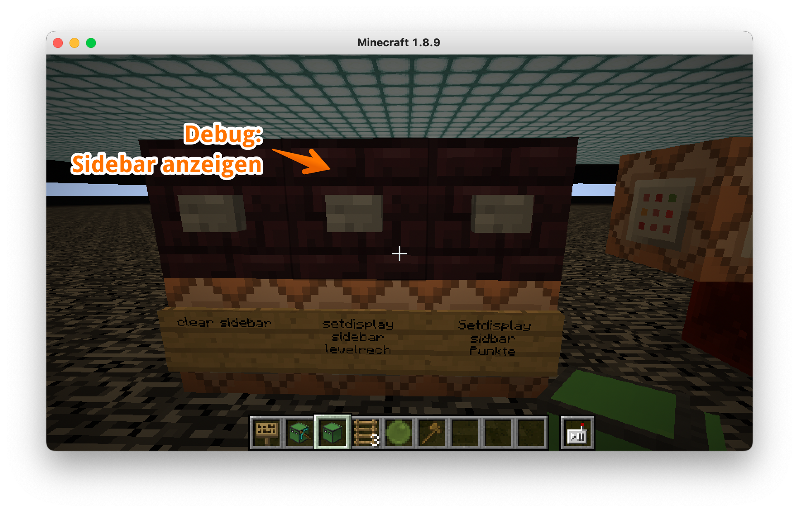

# Programmieren lernen in Minecraft - Videokurs

In diesem Repositorium findest Du alles, was zum Videokurs "Programmieren in Minecraft" gehört.

Mehr Infos zum Kurs findest Du auf meiner Webseite: https://kidslab.de/minecraft/

Fragen gerne per Mail: gregor@kidslab.de

# Willkommen zum "Programmieren in Minecraft" Videokurs!

## Lernkarten

Für die Stunden gibt es jeweils Lernkarten, die als Hilfe in der Stunde dienen. Dort sind die wichtigen Befehle und Aufgaben noch mal vermerkt.

## Folien zu den einzelnen Stunden

Sind jeweils in "Folien"

## Lösungen

Die Lösungen für die einzelnen Stunden findest Du unter [Lösungen](/Lösungen/readme.md)

## Admin

Im Keller gibts ganz viel Technik für die Lehrer!

### Support und Kontakt

Gerne können die Inhalte von Lehrern oder Erziehern für eigene Stunden genutzt werden. Die Inhalte stehen untec Creative Commons Lizenz: Namensnennung-Nicht (CC BY-NC).

Bei Fragen gerne melden: gregor@kidslab.de

