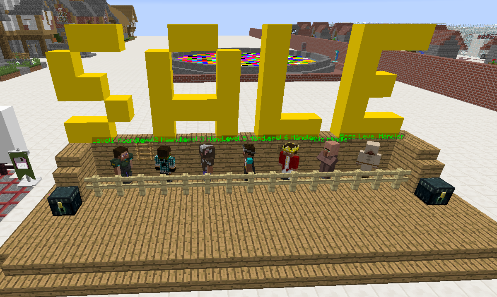
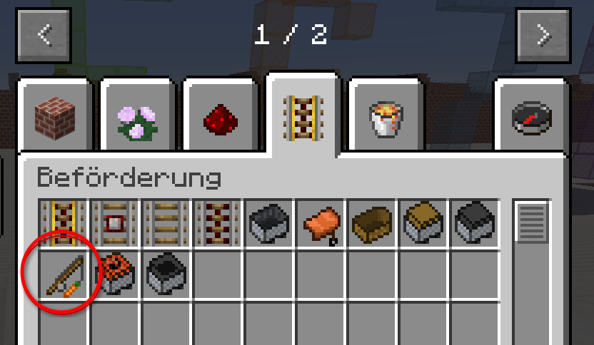
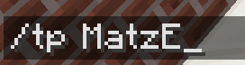
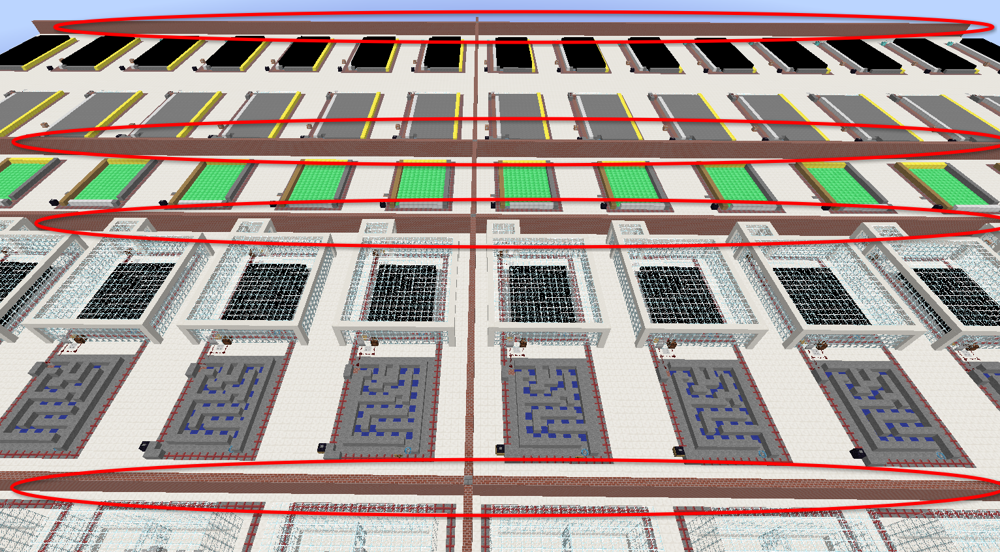
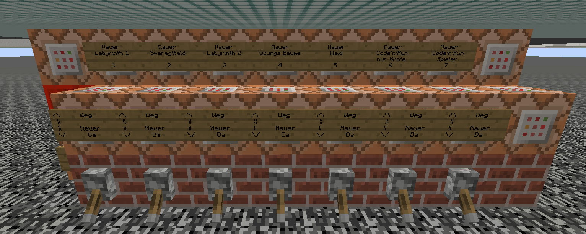

# Programmieren lernen in Minecraft - Online-Kurs

In diesem Repositorium findest Du alles, was zum Videokurs "Programmieren in Minecraft" gehört.

Mehr Infos zum Kurs findest Du auf meiner Webseite: https://kidslab.de/minecraft/

Fragen gerne per Mail: gregor@kidslab.de oder matze@kidslab.de

# Willkommen zum "Programmieren in Minecraft" Videokurs!
Bei dem Kurs lernen Kinder in Minecraft die Grundprinzipien vom Programmieren: Ablauf, Schleifen, Bedingungen, Funktionen ...
- Zielgruppenalter: ab 10 Jahren
- Umfang: 8 Stunden à 60 min
- Benötigt: Minecraft-Java-Lizenzen, Rechner, Maus + Tastatur, Server (hier mit Docker vorbereitet)

## In diesem Repo:

**Lernkarten:**

Für die Stunden gibt es jeweils Lernkarten, die als Hilfe in der Stunde dienen. Dort sind die wichtigen Befehle und Aufgaben noch mal vermerkt.  
Werden aktuell nicht aktiv eingesetzt. Möglicherweise veraltet.

**Folien zu den einzelnen Stunden:**

Sind jeweils in "Folien".

**Lösungen:**

Die Lösungen für die einzelnen Stunden findest Du unter [Lösungen](/Lösungen/readme.md).

## Kursablauf
### Vor der ersten Kursstunde
1 Termin **Technik-Check**  
Eine Möglichkeit, BigBlueButton, Mikrofon, Minecraft-Mod-Installation etc. zu testen und noch Hilfe hierfür anzubieten, damit im Kurs alles glatt läuft und nicht einzelne, die die Mod noch nicht haben, nicht mitmachen können bzw. einzelnen Helfen alle anderen ausbremst.
### Jede Kursstunde
Wir beginnen immer mit dem Theorieteil: Folien mit der Mechanik, die gelernt wird, und dann die Aufgabenstellung.  
Dann evtl. Fragen in großer Runde, damit nichts falsch verstanden wurde.  
Dann Breakout-Rooms in Gruppen von 2-8 Teilnehmern, die dann untereinander reden und sich beim Aufgabenlösen helfen können.  
Die Mentoren wandern dann von Raum zu Raum und helfen bei Fragen.  
Fertige Teilnehmer können sich am Spawn mit der erspielten Belohnung Cosmetics kaufen   
Nach Ablauf der Breakout-Räume folgt eine gemeinsame Frage-/Showcase-Runde und evtl. wird eine Musterlösung gezeigt.  
Feedback an die Mentoren fragen; Teilnehmer können in der Welt hinter dem Spawn Feedback loswerden.

### Einzelne Stunden:
**Schildkröte kennenlernen**

Schildkröte kennenlernen, um mit der Fernbedienung den mysteriösen Gegenstand zu finden.

[Präsentation 1](Folien/Stunde%201%20-%20MC%20Turtlekurs.pdf)

Video-Erklärung: (alte Welt)  
[YouTube Video](https://www.youtube.com/watch?v=3BofqEGoCDA)


**Labyrinth**

Der Schildkröte den Weg durchs Labyrinth beibringen.

[Präsentation 2](Folien/Stunde%202%20%E2%80%93%20MC%20Turtle%20Online-2.pdf)

Video-Erklärung: (alte Welt)  
[YouTube Video](https://www.youtube.com/watch?v=zgrJB9xQ2HQ)


**Treppenbau-Challenge**

Hier lernen wir Schleifen.

[Präsentation 3](Folien/Stunde%203%20%E2%80%93%20MC%20Turtle%20Online.pdf)


**Turtle City**

Heute schauen wir uns Turtle City an.  
Statt Folien zeigen wir hier https://handbuch.kidslab.de/minecraft/turtlecity

**Smaragdmäher**

Hier lernen wir Schleifen in Schleifen, sehr mächtig.

[Präsentation 4](Folien/Stunde%204%20%E2%80%93%20Smaragd%20m%C3%A4her%20%E2%80%93%20MC%20Turtle%20Online.pdf)


**Smaragdmäher ohne Zählen**

Die Schildkröte kann selber erkennen, wann sie umdrehen muss.  
Falls ... Dann ...

[Präsentation 5](Folien/Stunde%205%20-%20Wenn-Dann%20%E2%80%93%20MC%20Turtle%20Online.pdf)


**Zufalls-Labyrinth**

Noch mehr:  
Was ist, wenn ...  
Falls ... Dann ... abfragen.  
Die Schildkröte lernt, selber zu entscheiden.

[Präsentation 6](Folien/Stunde%206%20AutoLabyrinth%20%E2%80%93%20MC%20Turtle%20Online-1.pdf)


**Holz fällen**

Jetzt darf die Schildkröte arbeiten gehen.  
Wir lernen, Zufall zu nutzen und Unterprogramme zu starten.

[Präsentation 7](Folien/Stunde%207%20Holz%20F%C3%A4llen%20%E2%80%93%20MC%20Turtle%20Online-2.pdf)


**Code'n'Run**

Finale Challenge  
Alles zusammen

[Präsentation 8](Folien/Stunde%208%20%E2%80%93%20Code%20n%20run%20%E2%80%93%20MC%20Turtle%20Online.pdf)


## Serverinfrastruktur
Docker Compose

Docker starten
- Wenn keine Welt im Volume-Mapping: lädt Welt von unserem Git (https://github.com/KidsLabDe/MinecraftWorld-TurtleWorkshop)
- Wenn im Volume-Mapping: die wird genutzt

Mentor-Account ingame freischalten:  
Minecraft-Befehle:  
scoreboard ....  
erlaubt das Nutzen von Karottenrute und Teleport in den Technikraum  
op ...  
erlaubt das Nutzen von Befehlen wie /op weitererMentor, /tp, /give oder /gamemode

## Ingame für Kurs-Mentoren
### Immer wieder wichtig:
- Beim Betreten wird man immer zum Start teleportiert; dies ermöglicht jedem Teilnehmer, zurückzukehren, z. B. falls er/sie sich eingesperrt hat.
- Jeder Spieler (auch Mentoren) wird beim Betreten in den Abenteuermodus gesetzt (nichts abbauen, nicht fliegen etc.). Mit dem Befehl `/gamemode creative` können Mentoren in den Kreativmodus wechseln.
#### Karottenrute
  
damit Rechtsklick -> Zuschauermodus: durch Blöcke fliegen  
im Zuschauermodus Mausrad scrollen: schneller / langsamer fliegen  
im Zuschauermodus gerade nach oben schauen: zurück in den Kreativmodus  
im Zuschauermodus bist du für Teilnehmer unsichtbar

#### Befehl /tp
Befehle gibt man mit "/" im Chat ein. Also Chat mit "t" öffnen, dann "/" und dann den Befehl "tp".

tp = teleport und teleportiert dich oder Teilnehmer

**Beispiel**  
  
```/tp SpielerName```  
teleportiert dich zu dem Spieler, der SpielerName heißt

```/tp 0 20 0```  
teleportiert dich zum Start.

```/tp SpielerName 0 20 0```  
teleportiert SpielerName zum Anfang

```/tp @a 0 20 0```  
teleportiert alle zum Anfang

```/tp @a @p```  
teleportiert alle zu dir.

#### Technikraum / Lehrerzimmer:
##### Mauern:
  
Diese Mauern trennen die Level und können zu Beginn der Kursstunde weggemacht werden, wenn das Level dahinter erreichbar sein soll.  
  
Jeder Hebel hier kontrolliert eine Mauer
- Hebel oben: Mauer weg
- Hebel unten: Mauer da

__Hinweise__:
- Mithilfe der Schildkröten können kreative Teilnehmer immer einen Weg über die Mauer finden. Wir wollten es nicht komplett unmöglich machen und loben kreativen umgang mit der Technik eher. Neu gelerntes Kreativ anwenden um eigene Ziele umzusetzen eigentlich genau das was man beim programmieren lernen erreichen will ;)
- Die Hebel machen die Mauern nicht direkt weg. Sie verschwinden, sobald sich jemand nähert.


### Sonstiges
#### CustomNPC-Tools
NPC-Wand  
...

### Support und Kontakt

Gerne können die Inhalte von Lehrern oder Erziehern für eigene Stunden genutzt werden. Die Inhalte stehen unter Creative-Commons-Lizenz: Namensnennung-Nicht-kommerziell (CC BY-NC).

Bei Fragen gerne melden: gregor@kidslab.de
